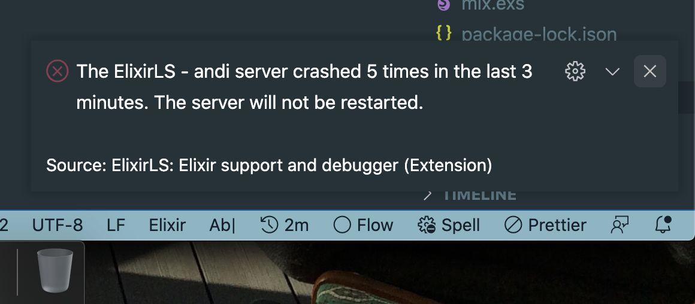

# VSCode Setup

Here’s how to get ElixirLS working for VSCode! Please update with what works / doesn’t work for you.

As of Sep 2022, ElixirLS complains about our elixir version being <11, if that dialog pops up for you while following these steps, you haven't messed anything up, we just have yet to up our elixir version to something more recent. The extension seems to function fine on our version,
even with that warning.

## Benefits:

- In editor “format on save”
- Elixir autocomplete
- Warnings about missing imports + unused variables
- Tooltips to reveal information about dependencies (if they're documented in code)

## Steps:

1. Remove the `_build` and `.elixir_ls` folders from the root of `smartcitiesdata` if they exist from past attempts to use ElixirLS

2. Remove any existing Elixir extensions. The [vscode-elixir extension](https://marketplace.visualstudio.com/items?itemName=mjmcloug.vscode-elixir) in particular was causing quite a few conflicts, and it’s advised in the ElixirLS readme to remove it specifically. Install the [ElixirLS: Elixir support and debugger](https://marketplace.visualstudio.com/items?itemName=JakeBecker.elixir-ls) extension. If you used to have it installed already, it's recommended to uninstall it and start with a fresh install.

3. Open a smart cities data app in vscode, or the entirity of `smartcitiesdata` and you should see the following notification.


- If that dialog doesn’t pop, open the command pallet and type `> View: toggle output` to open the output view. There, choose the ElixirLS option from the select element.


4. If something is wrong, you should see the following message, and can use the “output” view to debug.



- The following message `function ElixirLS.Utils.OutputDevice.get_opts/0 is undefined` means that you’re most likely using a <22 version of erlang.
- Restart VSCode, and be sure that 22 is shimmed correctly. Run `erl —version` from the directory of the app you have open in vscode, and you should see `Erlang/OTP 22` or higher.

5. If everything is working correctly, you should see the following in the output. ElixirLS is building a version of your app for auto completion. The initial compile step could take ~8 minutes but, afterwards, compiling happens in the background in a few seconds.

- I’ve noticed some battery drain from using the extension because of the compiling on save but, I don’t mind the tradeoff.


- When initial compiling is complete, you should see the dialog box pictured below, and the dialyzer_manifest file should be inside .elixir_ls


6. Enjoy autocomplete + code formatting on save!


### Helpful Debug Keybindings

Adding the following keybindings will enable some debugging shortcuts, since IO.inspects are the
[number 1 reccomended debugging method](https://elixir-lang.org/getting-started/debugging.html#ioinspect2). Highlighting a variable and
entering `cmd+l`, will add a prefilled debug IO.inspect statement on the line below.
`cmd+shift+l` will add a `|> IO.inspect(label: "")` wherever your cursor is.
These shortcuts / snippets are configured to only fire in elixir files.

1. Install the ["multi-command" extention](https://marketplace.visualstudio.com/items?itemName=ryuta46.multi-command)
2. Add the following to your VSCode settings.json (`cmd+shift+p` -> `> Open Settings (JSON)`)

```json
"multiCommand.commands": [
    {
      "command": "multiCommand.elixirInspect",
      "sequence": [
        "editor.action.clipboardCopyAction",
        "editor.action.insertLineAfter",
        {
          "command": "editor.action.insertSnippet",
          "args": {
            "snippet": "$CLIPBOARD |> IO.inspect(label: \"${1:$CLIPBOARD}\")"
          }
        }
      ]
    }
  ]
```

3. Add the following to your keybindings to get the above described keyboard shortcuts, customize as needed. (`cmd+shift+p` -> `> Preferences: Open Keyboard Shortcuts (JSON)`)

```
  {
    "key": "cmd+shift+l",
    "when": "editorTextFocus && editorLangId == 'elixir'",
    "command": "editor.action.insertSnippet",
    "args": {
      "snippet": "|> IO.inspect(label: \"\")"
    }
  },
  {
    "key": "cmd+l",
    "command": "extension.multiCommand.execute",
    "args": { "command": "multiCommand.elixirInspect" },
    "when": "editorTextFocus && editorLangId == 'elixir'"
  },
```
